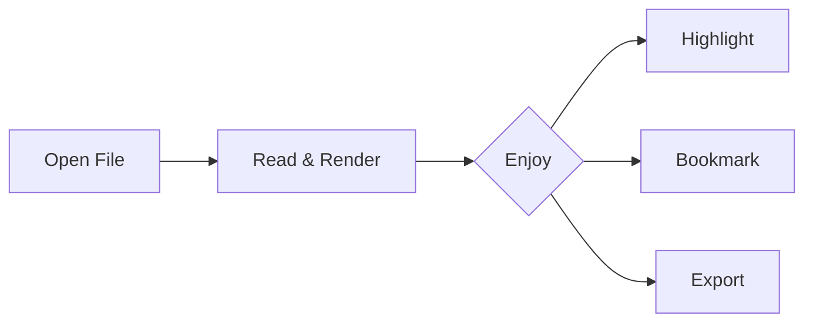

## Getting Started

Open any `.md` or `.markdown` file with **Ctrl+O**, or drag and drop it onto the window.

Bindars remembers your recently opened files in the sidebar (**Ctrl+B**), and restores your last reading position when you reopen a file.

## Features

### Rich Markdown Rendering

Bindars renders GitHub Flavored Markdown with full support for tables, task lists, footnotes[^1], and syntax-highlighted code:

```javascript
function greet(name) {
  return `Hello, ${name}!`;
}
```

### Math Equations

Inline math like $E = mc^2$ and display equations are rendered with KaTeX:

$$
\int_{-\infty}^{\infty} e^{-x^2} \, dx = \sqrt{\pi}
$$

### Mermaid Diagrams



### Highlights & Annotations

Select any text to highlight it in one of four colors. Open the annotations panel (**Ctrl+M**) to review your highlights, add notes, and export everything to Markdown.

### Workspace

Set a workspace folder to search across all your Markdown files with the command palette (**Ctrl+K**). Bindars indexes headings, content, and links for fast full-text search.

## Keyboard Shortcuts

| Shortcut | Action |
|---|---|
| **Ctrl+O** | Open file |
| **Ctrl+B** | Toggle sidebar |
| **Ctrl+J** | Toggle table of contents |
| **Ctrl+F** | Search in document |
| **Ctrl+K** | Command palette |
| **Ctrl+M** | Toggle annotations panel |
| **Ctrl+D** | Bookmark current heading |
| **Ctrl+E** | Toggle edit mode |
| **Ctrl+Shift+T** | Cycle theme |
| **Ctrl+Shift+F** | Focus mode |
| **?** | Keyboard shortcuts overlay |

## Themes

Cycle through Light, Sepia, Dark, and Midnight themes with **Ctrl+Shift+T**, or pick one directly from Reader Settings (the Aa button in the header).

---

Happy reading!

[^1]: Footnotes are rendered at the bottom, like this one.
