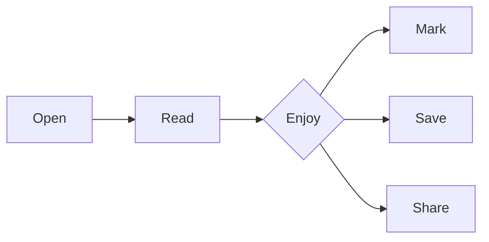

## Getting Started

Open any `.md`, `.markdown`, or `.fountain` file with **{{shortcut:openFile}}**, or drag and drop it onto the window. Press **{{shortcut:newFile}}** to start a new Markdown document.

Bindars remembers your recently opened files in the sidebar (**{{shortcut:toggleSidebar}}**), and restores your last reading position when you reopen a file.

### Editing

Press **{{shortcut:toggleEditMode}}** to make the current document editable without losing your reading position. The editor supports undo history and find/replace. Save manually with **{{shortcut:saveFile}}**; Bindars warns before navigation or exit when unsaved work remains.

Markdown headings receive optional live formatting while editing. Use **{{shortcut:toggleMarkdownFormatting}}** to switch instantly between formatted headings and plain markup. Other Markdown syntax remains visible and editable as ordinary text.

## Features

### Rich Markdown Rendering

Bindars renders GitHub Flavored Markdown with full support for tables, task lists, footnotes[^1], and syntax-highlighted code:

```javascript
function greet(name) {
  return `Hello, ${name}!`;
}
```

### Math Equations

Inline math like $E = mc^2$ and display equations are rendered with KaTeX:

$$
\int_{-\infty}^{\infty} e^{-x^2} \, dx = \sqrt{\pi}
$$

### Mermaid Diagrams


```mermaid
graph LR
    A[Open] --> B[Read]
    B --> C{Enjoy}
    C --> D[Mark]
    C --> E[Save]
    C --> F[Share]
```

### Highlights & Annotations

Select any text to highlight it in one of four colors. Open the annotations panel (**{{shortcut:toggleAnnotations}}**) to review your highlights, add notes, and export everything to Markdown.

### Workspace

Set a workspace folder to search across all your Markdown files with the command palette (**{{shortcut:workspaceSwitcher}}**). Bindars indexes headings, content, and links for fast full-text search.

## Keyboard Shortcuts

| Shortcut | Action |
|---|---|
| **{{shortcut:newFile}}** | New Markdown document |
| **{{shortcut:openFile}}** | Open file |
| **{{shortcut:saveFile}}** | Save while editing |
| **{{shortcut:toggleSidebar}}** | Toggle sidebar |
| **{{shortcut:toggleTableOfContents}}** | Toggle table of contents |
| **{{shortcut:searchDocument}}** | Search in document |
| **{{shortcut:workspaceSwitcher}}** | Command palette |
| **{{shortcut:toggleAnnotations}}** | Toggle annotations panel |
| **{{shortcut:bookmarkHeading}}** | Bookmark current heading |
| **{{shortcut:toggleEditMode}}** | Toggle edit mode |
| **{{shortcut:toggleMarkdownFormatting}}** | Toggle Markdown formatting while editing |
| **{{shortcut:cycleTheme}}** | Cycle theme |
| **{{shortcut:focusMode}}** | Focus mode |
| **{{shortcut:showShortcuts}}** | Keyboard shortcuts overlay |

## Themes

Cycle through Light, Sepia, Dark, and Midnight themes with **{{shortcut:cycleTheme}}**, or pick one directly from Reader Settings (the Aa button in the header).

---

Read well.

[^1]: Footnotes are rendered at the bottom, like this one.
